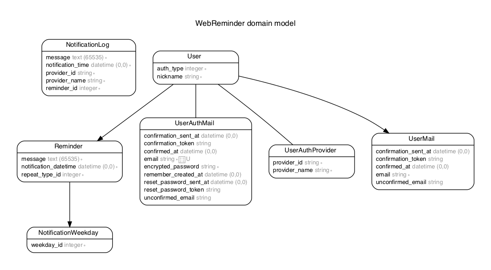

# アプリケーション名

CloudReminder

# アプリケーション概要

Web上でリマインダーを設定して、設定した日時にLINEやメールに通知を送れるウェブサービスです。
1回きりの通知だけでなく、毎日通知や毎週指定曜日に通知の設定もできます。

# URL

[https://web-reminder.jp/](https://web-reminder.jp/)

# テスト用アカウント

* メールアドレス : `test@web-reminder.jp`
* パスワード     : `abc123`

# 利用方法

* トップページファーストビュー中央の「今すぐ始める」または右上の「新規登録」からアカウント登録に進んでください。

* メールに通知を贈りたい場合はメールアドレスで登録を、LINEに通知を贈りたい場合はLINEアカウントで登録をしてください。

* メールアドレスで登録する場合は、入力したメールアドレスに送られるメールに記載されている認証用URLから本登録に進んでください。

*  LINEアカウントで登録する場合は、公式アカウントと友達登録をお願いします
    * 友達登録しないと通知が送られません

* リマインダー作成からリマインダーを登録してください。
  * 登録が完了したらWEBアプリは閉じていただいて大丈夫です。
  * 設定した日時になれば、通知が送られます。

* リマインダーの編集・削除はマイページから可能です。

* ユーザーアカウントの編集・削除は、画面右上のユーザーアイコンからユーザーアカウントページへ移行して行ってください。

# 目指した課題解決

忘れてはいけないことを通知によって思い出させることで日々のタスクのやり忘れを防ぎます。
その通知先として、それぞれのユーザーが自分が特によく確認するものに通知させるように設定できるようにすることで、リマインダーを設定したがその通知にも気付かなかったといったことを少しでも減らすことが出来れば良いと考えました。

# インフラ構成

# データベース設計

## usersテーブル

| Column             | Type   | Options     |
| ------------------ | ------ | ----------- |
| nickname           | string | null: false |

Association

+ has_one :user_auth_mail
+ has_one :user_auth_provider
+ has_many :user_notification_mails
+ has_many :user_notification_providers
+ has_many :reminders

## user_auth_mails

| Column               | Type       | Options     |
| -------------------- | ---------- | ----------- |
| email                | string     | null: false |
| encrypted_password   | string     | null: false |
| confirmation_token   | string     | null: false |
| confirmed_at         | string     | null: false |
| confirmation_sent_at | string     | null: false |
| unconfirmed_email    | string     | null: false |
| user                 | references | foreign_key: true |

Association

+ belongs_to :user

## user_auth_providers

| Column               | Type       | Options     |
| -------------------- | ---------- | ----------- |
| provider_name        | string     | null: false |
| provider_id          | string     | null: false |
| user                 | references | foreign_key: true |

Association

+ belongs_to :user

## reminders

| Column                | Type       | Options     |
| --------------------- | ---------- | ----------- |
| message               | text       | null: false |
| notification_datetime | datetime   | null: false |
| repeat_type_id        | integer    | null: false |
| user                  | references | null: false, foreign_key: true |

Association

+ belongs_to :user
+ has_many   :notification_weekdays

## notification_logs

| Column                     | Type       | Options     |
| -------------------------- | ---------- | ----------- |
| notification_time          | datetime   | null: false |
| provider_name              | string     | null: false |
| provider_id                | string     | null: false |
| message                    | text       | null: false |
| reminder_id                | integer    | null: false |

Association

+ nothing
